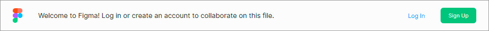
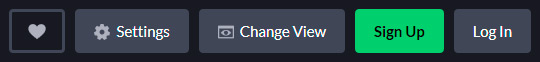
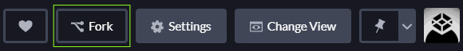
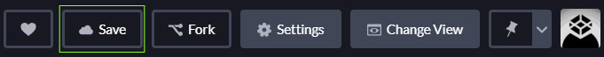
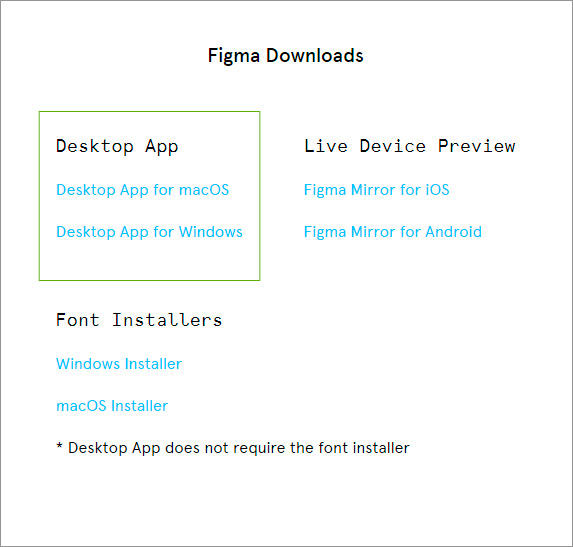
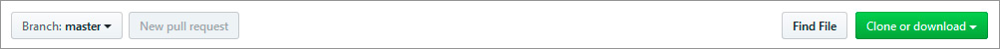
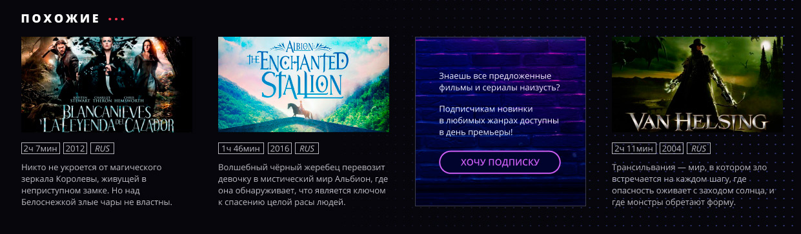

# Education-Show

## Полезные ссылки
* [WebReference](https://webref.ru/) — С правочник по всем HTML-тегам и CSS-свойствам
* [W3CSchool](https://www.w3schools.com/) — Большой сайт с интерактивными упраждениями для тренировки
* [Блог Workafrolic (±∞)](https://medium.com/@ABatickaya) — Блог с переводами полезных статей по фронтенду, в том числе для начинающих
* [Codepen](https://codepen.io/) — Онлайн-редактор для вёрстки

---

## Как работать с проектом

Проект создан таким образом, чтобы с ним было удобно работать как полностью онлайн, так и локально, у себя на компьютере.

### Онлайн

Для работы понадобится только ваш браузер.

Макет доступен на сайте Figma по [ссылке](https://www.figma.com/file/6KaF5VYqif23GYVfOWs2wF/Show?node-id=0%3A1). Чтобы получить возможность просматривать стили всех отдельных элементов, необходимо зарегистрироваться на [figma.com](https://www.figma.com/). Для регистрации нажмите на зелёную кнопку «Sign Up» во всплывающем окне или на главной странице:

Вёрстка проекта доступна на сайте Codepen по [ссылке](https://codepen.io/Netology/pen/ZEzeGxO?editors=1100). Чтобы приступить к работе, необходимо также зарегистрироваться на [codepen.io](https://codepen.io/):

После чего создайте свою персональную копию проекта, нажав на кнопку «Fork»:

Теперь можно писать код! Закончив работу, не забудьте сохранить изменения, нажав на кнопку «Save»:

### Локально

Для работы понадобится скачать и установить графический редактор Figma и редактор кода.

Figma распространяется бесплатно. Чтобы начать использовать это приложение, зарегистрируйтесь на сайте [figma.com](https://www.figma.com/), после чего скачайте версию приложения для вашей системы по [ссылке](https://www.figma.com/downloads/):

Для написания кода можно использовать и «блокнот», но мы очень рекомендуем воспользоваться профессиональным редактором кода. Выберите любой из предложенных редакторов; все они распространяются бесплатно:

* [Atom](https://atom.io/)
* [Brackets](http://brackets.io/)
* [Sublime](https://www.sublimetext.com/)

Теперь, когда всё готово к работе, скачайте файлы проекта с сайта GitHub по [ссылке](https://github.com/netology-code/Education-Show). Нажмите на зелёную кнопку «Clone or download», затем выберите «Download ZIP»:

Распакуйте проект. 

* В файле *index.html* находится HTML-разметка документа;
* В файле *styles.css* находится таблица стилей;
* В папке *img* находятся растровые изображения, в папке *svg* — изображения в векторном формате;
* В папке *sources* находятся макеты: *education-series.fig* — макет, который верстается на занятии, и *education-series-w-homework.fig* — макет с домашним заданием.

---

## Домашнее задание

Мы начинаем рекламировать наш сервис, и для начала нужно добавить на страницу рекламный баннер. Наш штатный верстальщик только начал работу над баннером, и вам предстоит её закончить.

Баннер будет занимать место одного из фильмов:

Если вы работаете онлайн, то обновленный макет доступен по [этой ссылке](https://www.figma.com/file/NzajExvPomVvs24tjk3V70/Show-Homework?node-id=1%3A2), если локально, то нужный макет *education-series-w-homework.fig* лежит в папке *sources*.

В файле *index.html* уже создана разметка для баннера. Вам нужно раскомментировать её, чтобы увидеть блок на странице — удалите символы `<!--`  в начале и `-->` в конце. А фильм «Гнев Титанов», вместо которого мы ставим баннер, нужно будет, наоборот, закомментировать: добавьте `<!--`  в начале и `-->` в конце блока этого фильма.

Далее вам остаётся только скопировать текст из макета и дописать недостающие стили:

* Ширину блока;
* Внутренние отступы блока;
* Рамку блока;
* Нужный размер текста и его цвет;
* Размер кнопки, её фоновый цвет, скругление углов и рамку, а также размер и цвет текста на кнопке;
* При помощи псевдокласса `:hover` создать ховер-эффект для кнопки: при наведении курсора должен меняться фоновый цвет кнопки и цвет текста на кнопке;
* Путь до картинки с фоном (`https://netology-code.github.io/Education-Show/img/subscribe-background.jpg`) — скопируйте ту сточку, что мы писали для фона блока, который верстали, и замените путь до картинки.
